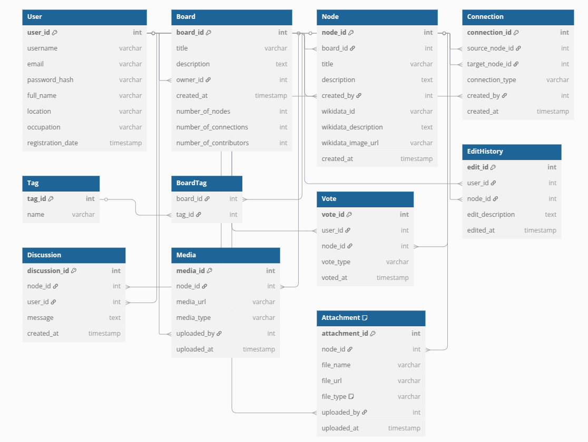

  

  

## Research
### wikidata
<ul>
  <li>Wikidata was launched in 2012 as a sister project of Wikipedia. It is an open-source platform that serves as central storage for structured data.</li>
  <li>Some of the Wikidata query examples can be found at: <a href="Wikidata_Examples_Page.md">Wikidata Examples</a></li>
</ul>

## Elicitation Questions

The aim of the elicitation questions is gathering information, clarifying the requirements of the project.

Elicitation questions can be found at : <a href="elicitation_questions.md">Click</a></li>

## Mockups

The aim to create mockup is to understand the project requirements better. <a href="mockups.md">Click</a></li>

## SRS Documentation

Detailed SRS Documentation Can be Found : <a href="srs.md">Click</a></li>

## Final Project Report Can be Found : 

Final report, (user manual and test user included can be found at) : <a href="deliverables/final_report.pdf">Click</a></li>

## Derivilables:

### 📅 Project Timeline (March 25 – May 13, 2025)

#### 🟢 - March 25: Requirements & Design Phase
- [x] Collect and document all functional and non-functional requirements  
- [x] Define user roles and interaction flows  
- [x] Create user stories and use cases  
- [x] Design low-fidelity wireframes and flow diagrams  
- [x] Prepare design mockups  
- [x] Plan technical architecture (frontend, backend, data model, APIs)  
- [x] Draft initial project plan and timeline  
- [x] Decide on tech stack and CI/CD tools (e.g., GitHub Actions, GitLab CI)
- [x] Configure CI pipeline (lint, test, build)
- [x] Backend setup: authentication, database models, REST APIs  
- [x] Frontend setup: layout, routing, forms
- [x] Implement user registration & login

#### 🌐 March 25 – April 1: Infrastructure Setup
- [x] Choose hosting platform (e.g., Vercel, Netlify, Heroku, AWS)  
- [x] Configure environment variables and secrets  
- [x] Set up PostgreSQL hosting (e.g., Supabase or Railway)  
- [x] Connect frontend/backend to the hosted DB  
- [x] Enable HTTPS and domain setup (optional)
- [x] Deploy first staging version via CI/CD
- [x] Prepare `Dockerfile` and basic `docker-compose` setup  
- [x] Add automated tests to pipeline  
- [x] Configure deployment pipeline (staging environment)
- [x] Configure CI pipeline (lint, test, build)
- [x] Set up Git repository and branching strategy
- [ ] Implement unit tests
      
#### 🟠 April 8 – April 20: Interactive & Visual Features
- [ ] Implement connection editing with history tracking  
- [x] Build graph-based visualization (D3.js or Cytoscape.js)  
- [ ] Create filterable UI for nodes and relationships  
- [x] Begin Wikidata integration (SPARQL suggestions)  
- [ ] Display user contribution history  
- [ ] Predefined tag logic and UI
- [ ] Integrate tag-based classification system
- [x] Implement Boards, Tags, Connections logic
- [x] Implement Board creation
- [x] Implement Node creation
- [x] Implement Connection creation

#### 🔵 April 21 – May 9: Final Features, Testing & Fixes
- [ ] Add discussion section per node  
- [ ] Implement trending topics algorithm  
- [ ] Add contributors view per topic  
- [ ] Finalize media upload and quick access links  
- [x] Complete system testing: functionality, UX, performance  
- [x] Fix critical bugs and polish design  
- [x] Add final test coverage to CI/CD pipeline  

#### 🟣 May 10 – May 13: Final Packaging & Delivery
- [x] Run final testing on production or staging  
- [x] Record product demo video (if needed)  
- [x] Write handover guide or user documentation  
- [x] Package and deliver the final product  
- [x] Present or deploy project publicly  

# DB ER Diagram

  

