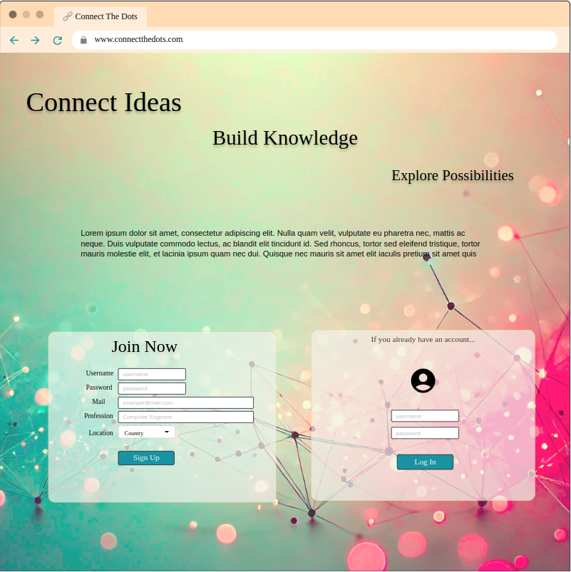
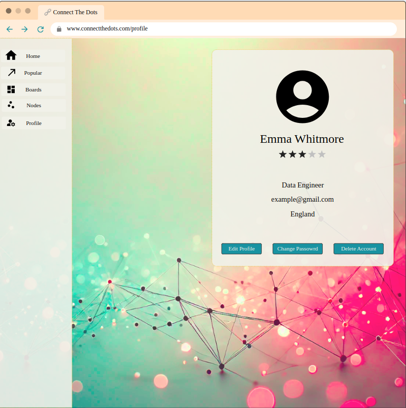
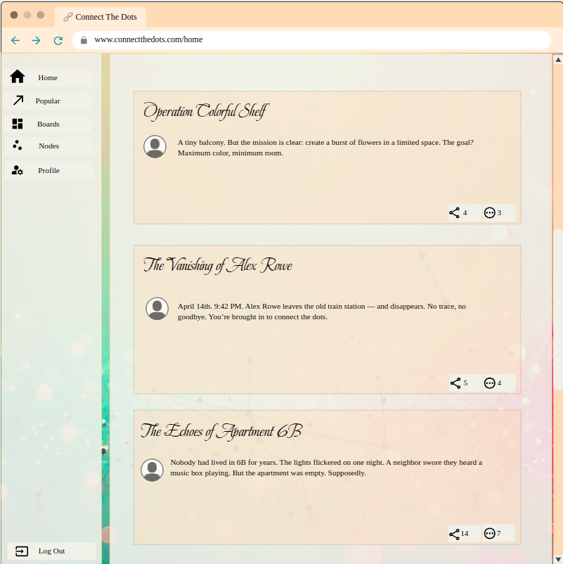
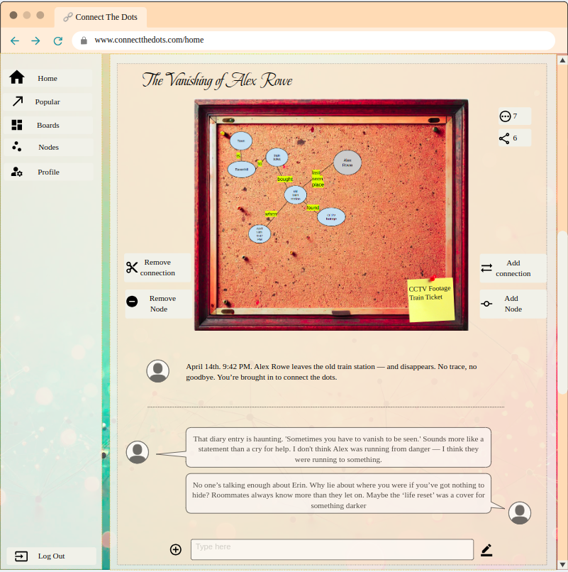
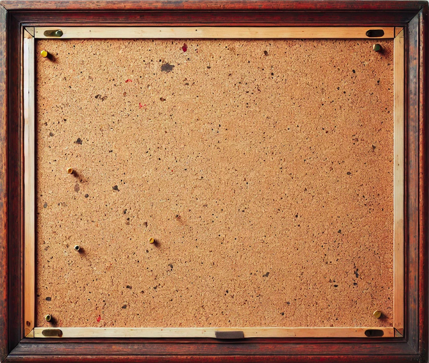
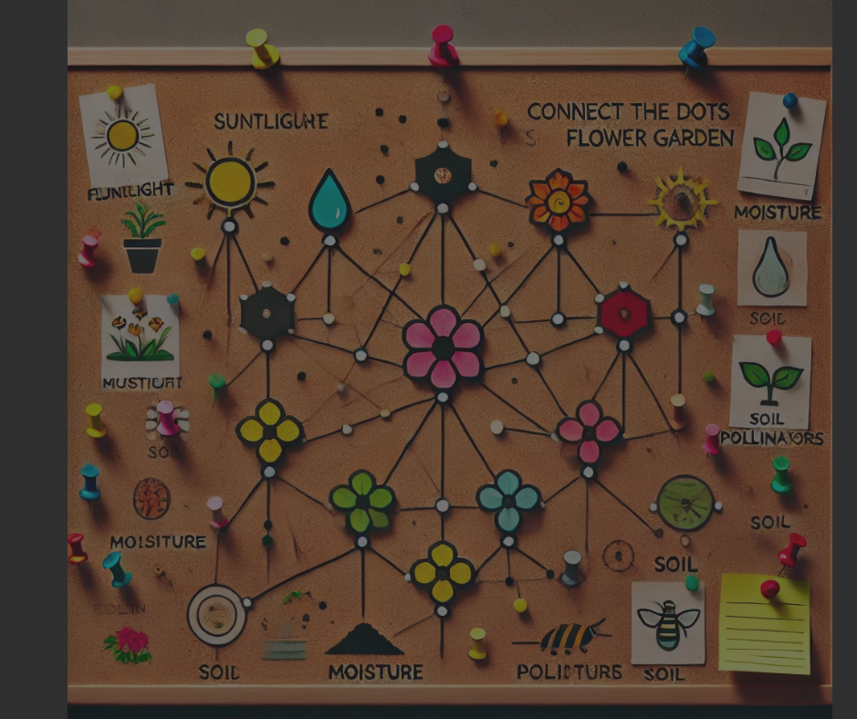

# Mockups

## Landing Page

  

## Profile Page

  

## Home Page

  

## Board Page

  

## Board Page Template Board
I decided to use regular corkboard for the board.

  

## What is the idea for the filled board?

  

